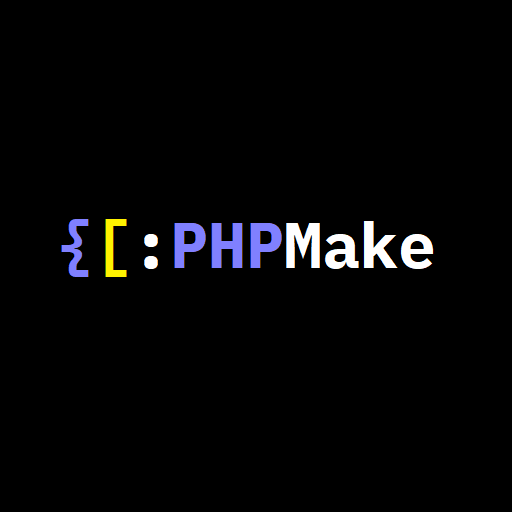

# [PHPMake](https://github.com/phpmake/phpmake/)

A PHP build automation tool using JSON configuration file.

[](https://packagist.org/packages/phpmake/phpmake) [](https://github.com/phpmake/phpmake/actions/workflows/default.yml) [](https://github.com/phpmake/phpmake/actions/workflows/github-code-scanning/codeql) [](https://github.com/phpmake/phpmake/actions/workflows/dependabot/dependabot-updates)
[](https://php.net/) [](https://github.com/phpmake/phpmake/issues)  [](LICENSE) [](CONTRIBUTING.txt)



## Contents

* [Overview](#overview)
* [Features](#features)
* [Requirements](#requirements)
* [Diagrams](#diagrams)
* [Installation](#installation)
* [Usage](#usage)
* [FAQ](#faq)
* [Support](#support)
* [Changelog](#changelog)
* [ToDo](#todo)
* [Contributing](#contributing)
* [Code of Conduct](#code-of-conduct)
* [DCO](#dco)
* [Contributors](#contributors)
* [Notice](#notice)
* [License](#license)

## Overview

A lightweight PHP-based build automation tool inspired by Linux Make & Apache Ant, using JSON configuration files. It supports common tasks like file operations, command execution, and dependency management with cross-platform compatibility (Windows/Linux/macOS).

## Features

* **Dependency-free**: No dependency-hell and even dependency-free!
* **JSON configuration**: Define build processes in human-readable JSON
* **Task dependencies**: Specify execution order with dependencies
* **Cross-platform**: Works on Microsoft Windows & GNU+Linux
* **Built-in tasks**:
  * `create_directory` (create directories)
  * `delete` (remove files/directories)
  * `copy` (file/directory copying)
  * `exec` (execute shell commands)
  * `echo` (output messages)
  * `archive` (archive/compress a file or directory)
* **Logging options**:
  * `-d`/`--debug` for detailed logs
  * `--no-log` to disable file logging
  * `-s`/`--silent` for minimal output
* **Validation**: `--validate-build` to check configuration syntax
* **System diagnostics**: `--diagnostics` to show environment info
* **DevOps ready**: CI/CD pipeline integration
* **Supported PHP:** 7.4 & 8.3
* **Supported platforms:** Microsoft Windows, GNU+Linux, Apple MacOS

## Requirements

1. PHP >= 8.3
2. Composer >= 2

### Versions

| Package version | Branch        | PHP version | Status         |
|-----------------|---------------|-------------|----------------|
| dev-main        | `main`        | 8.3         | Active         |
| 2.*             | `main`        | 8.3         | Active         |
| 1.*             | `main-php7.4` | 7.4         | Active         |

* **Active**: Full support
* **Maintenance**: Bug/Security fixes only
* **EOL**: Unsupported

## Diagrams

### Component diagram

```sh
+--------------------+      +-------------------+
| Build Configuration|<----+| CLI Parser        |
| (build.json schema)|      | (Parses arguments)|
+--------------------+-|    +-------------------+
           ^           |           |
           |           |           v
           |           |  +-------------------+
           |           +->| Build Executor    |
           |              | (Runs targets)    |
           |              +-------------------+
           |                      |
           |                      v
           |              +---------------------+
           +------------->| Task Factory        |
                          | (Instantiates tasks)|
                          +---------------------+
                                |
                                v
                          +-----------------------------+
                          | Tasks (delete/copy/exec/...)|
                          +-----------------------------+
                                |
                                v
                          +----------------------+
                          | Logger               |
                          | (Handles output/logs)|
                          +----------------------+
                                ^
                                |
                          +-------------------------+
                          | Validator               |
                          | (Checks config validity)|
                          +-------------------------+
```

### Workflow diagram

```sh
+-------------------+
| 1. CLI Input      |
| * Parse arguments |
+-------v----------+
| 2. Load/Validate  |
| * Read build.json |
| * Validate schema |
+-------v----------+
| 3. Dependency     |
|  Resolution       |
| * Determine order |
+-------v----------+
| 4. Execute Tasks  |
| * Run tasks       |
| * Handle errors   |
+-------v----------+
| 5. Output Results |
| * Show logs       |
| * Exit status     |
+-------------------+
```

## Installation

By [Composer](https://getcomposer.org/) project-specific installation:

```shell
composer require --dev phpmake/phpmake
```

By [Composer](https://getcomposer.org/) global installation:

```shell
composer global require phpmake/phpmake
```

## Usage

1. **Create a `build.json` file**:

    ```json
    {
        "name": "MyProject",
        "description": "Sample project build configuration",
        "version": "2.0.0",
        "targets": {
            "clean": {
                "tasks": [{ "type": "delete", "params": { "path": "build" } }]
            },
            "build": {
                "depends": ["clean"],
                "tasks": [
                    { "type": "create_directory", "params": { "name": "build" } },
                    { "type": "copy", "params": { "source": "src/", "dest": "build/" } },
                    { "type": "exec", "params": { "command": "php compiler.php" } }
                ]
            }
        },
        "default_target": "build"
    }
    ```

2. **Run the builder**:

For GNU+Linux:

```sh
chmod +x bin/phpmake.php
```

Then

```sh
vendor/bin/phpmake
```

Or

```sh
php vendor/bin/phpmake
```

Or

```sh
# Validate configuration.
php vendor/bin/phpmake --validate

# Run default target with debug logging.
php vendor/bin/phpmake --debug
```

Or

```sh
# Run test target silently.
php vendor/bin/phpmake test --silent
```

### QA/QC test

Run tests to ensure everything works as expected:

```shell
composer test
```

Or

```shell
vendor/bin/phpunit tests/
```

### Commands

| Command                 | Description             |
| ----------------------- | ----------------------- |
| `phpmake`               | Run default target      |
| `phpmake <target>`      | Run specific target     |
| `phpmake --help`        | Show help menu          |
| `phpmake --version`     | Show PHPMake version    |
| `phpmake --validate`    | Validate build file     |
| `phpmake --diagnostics` | Show system information |
| `phpmake -d/--debug`    | Enable debug/verbose logging |
| `phpmake -nl--no-log`   | Disable file logging         |
| `phpmake -s/--silent`   | Suppress console output      |
| `phpmake --init`        | Create sample build.json file|

### Supported tasks

| Task type          | Parameters                      | Description            |
| ------------------ | ------------------------------- | ---------------------- |
| `create_directory` | `name` (string)                  | Create directory       |
| `delete`           | `path` (string)                 | Delete file/directory  |
| `copy`             | `source` (string), `dest` (string) | Copy files/directories |
| `exec`             | `command` (string)              | Execute shell command  |
| `echo`             | `message` (string)              | Output message         |
| `archive`          | `dir` (string)                  | Archive a directory    |

### Example build file

See [build.json.example](build.json.example) file.

## FAQ

See [FAQ.txt](FAQ.txt) file.

## Support

For any question, issues and feature requests, [open an issue.](https://github.com/phpmake/phpmake/issues).

## Changelog

See [CHANGELOG.txt](CHANGELOG.txt) file.

## ToDo

See [TODO.txt](TODO.txt) file.

## Contributing

Contributions are welcome! Please follow these steps:

1. Fork repository.
2. Create a new branch for your feature or bugfix.
3. Submit a pull request with a detailed description of your changes.

For more details see [CONTRIBUTING.txt](CONTRIBUTING.txt).

## Code of Conduct

See [CODE_OF_CONDUCT.txt](CODE_OF_CONDUCT.txt) file.

## DCO

See [DCO.txt](DCO.txt) file.

## Contributors

See [CONTRIBUTORS.txt](CONTRIBUTORS.txt) file.

## Notice

See [NOTICE.txt](NOTICE.txt) file.

## License

This open-source software is distributed under the GPL-3.0 license. See [LICENSE](LICENSE) file.
